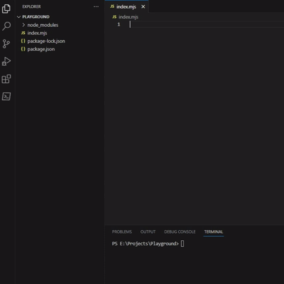

# cracksdb

A minimalist permanent state management npm package.

StateFile Architecture is the concept behind cracksdb. In case you're willing to know how exatly it works, contributes to it, or use all it's features properly. You may want to read [this article](https://dev.to/_moehab/statefile-a-minimalist-design-for-permanent-state-management-43d7).



# Usage

You can install cracksdb in your node project with the command:

```bash
npm i cracksdb
```

cracksdb can be used either by javascript or typescript. However, typescript is highly recommended for best practice; with javascript it can be easly misused. For instance, `stateFile.extendUnitType(obj: Type)` method can be passed object values that are not compatible with `Type`, and that could wind up with unexpected results or errors.

Using cracksdb is very simple, we shall first import StateManager and FileManager to initialize or minial db variable.

```typescript
import { StateManager, FileManager } from 'cracksdb'
```


Then we construct a StateManager instance by passing to the constructor the root dir value and a FileManager instance.

> FileManager constructor could be passed an object of File object values, however, it's not necessary. An empty object will do the job.

```typescript
const db = new StateManager("./db", new FileManager({}));
```

StateManager automatically scans the root dir and loads the application state for you. However, in case it's just empty so far. You may define and declare your application substates with the method `db.add(substate_name)`.

```typescript
const users = db.add("users") // returns a StateFile object
```

The structure of data units stored in _users_ substate may be defined either by using `users.extendUnitType(obj: Type)` method or by using generic `db.add<DataUnit>(...)` at the first place.

> _Type_ is a map from strings to the set of values: "string", "number", "boolean", and Type itself.

```typescript
const users = db.add<{name: string}>("users")
users.extendUnitType({
    age: "number"
})
```

To retrieve StateFiles from `db`, remove, or delete them. You may write:

```typescript
const users = db.get("users") 
users.add({
    name: "Jack",
    age: 20
})

console.log(user.get(0)) // {name: "jack", age: 20}
console.log(user.getWhere(obj => (obj.age > 15))) // {name: "jack", age: 20}
console.log(user.removeWhere(obj => (obj.age > 15))) // [true]

db.remove("users") // only removed virtually (from RAM).
db.delete("users", "mypassword") // removes users virtually and physically. 

```

StateManager can delete a StateFile only if it's been assigned a _passkey_ at first place. passkeys can be assigned to StateFiles by passing them in the second parameter of `db.add(substate_name, passkey)` method.

```typescript
const mysf = db.add("mysf", "password")
db.delete("mysf", ""); // logs a warning
db.delete("mysf", "password"); // deletes mysf files
```

That's pretty much it. Now you are ready to go with crackdb. 

In case you want to know more about cracksdb and how it works, you may read [this article](https://dev.to/_moehab/statefile-a-minimalist-design-for-permanent-state-management-43d7). Or you can just play around with it by using the below interface as a reference to its methods.

```typescript
interface StateFile<DataUnit> {
    len(): number;
    passkey(): string;
    setLimit(limit: number): void;
    getSimul(): boolean;
    setSimul(simul: boolean): void;

    addMetaAttr(attr: string, value: string): boolean;
    rmvMetaAttr(attr: string): boolean;
    getUnitType(): Type;
    extendUnitType(extension: Type): void;
    
    get(index: number): DataUnit;
    getWhere(cond: Condition<DataUnit>): DataUnit;
    getList(from: number, to: number): Array<DataUnit>;
    getListWhere(cond: Condition<DataUnit>): Array<DataUnit>;
    getIndexOf(cond: Condition<DataUnit>): number[];

    add(obj: DataUnit): void;
    update(index: number, newdata: DataUnit): boolean;
    updateWhere(cond: Condition<DataUnit>, newdata: DataUnit): boolean[];
    remove(index: number): boolean;
    removeWhere(cond: Condition<DataUnit>): boolean[];

    loadAll(): void;
    loadOne(): boolean;
    unloadOne(): boolean;

    seal(newCrackData?: Array<DataUnit>): void;
    split(): void;
    save(): void;
}
```
